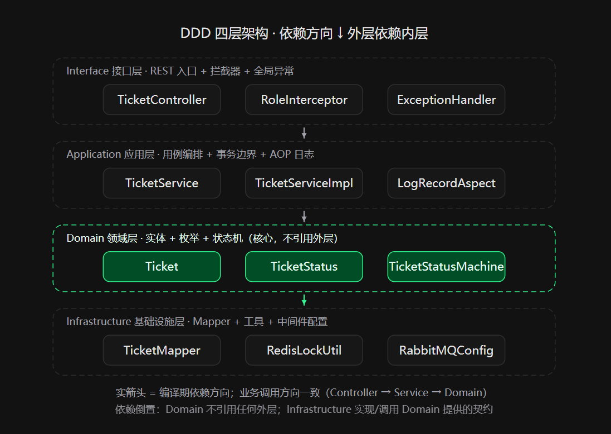
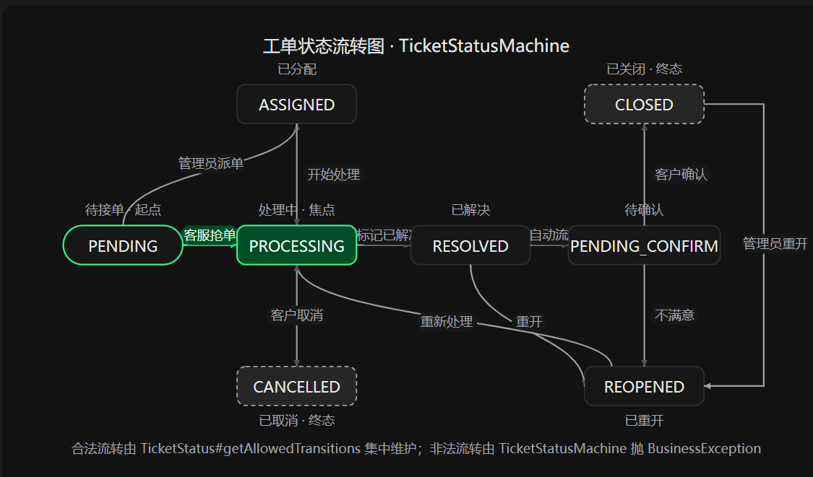
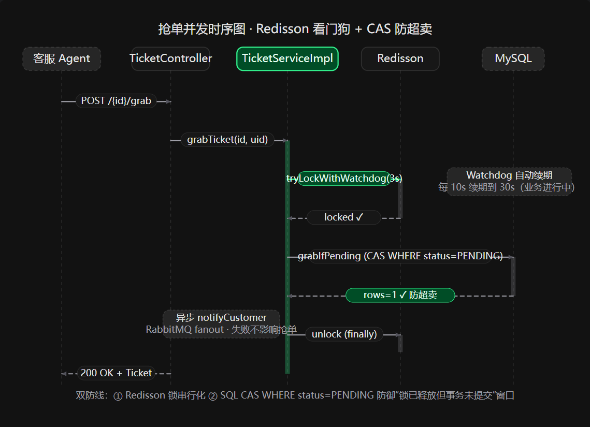

# DDD 工单系统 (DDD Ticket System)

> 基于 Spring Boot 3.x + DDD + 状态机 + Redisson 的轻量级企业工单管理系统

[](https://spring.io/projects/spring-boot)
[](https://www.oracle.com/java/)
[](https://vuejs.org/)
[](LICENSE)

---

## 📖 项目简介

本项目是一个仿照企业级 Support Desk 的轻量级工单管理系统。核心业务涵盖：**用户提交工单、客服抢单、状态流转、异步通知、满意度评价**。

系统不追求大而全，重点在于展示**领域驱动设计（DDD）落地、状态机管控复杂流转、分布式锁解决并发抢单、领域事件解耦 MQ 异步通知**等后端架构设计思想。

---

## ✨ 核心技术亮点

- **DDD 四层架构**：严格遵循 Interfaces → Application → Domain → Infrastructure 分层。领域层保持纯净，无任何框架依赖。
- **状态机驱动**：使用 Spring StateMachine 严格管控工单状态流转，拒绝 `if-else` 硬编码，天然拦截非法状态变更。
- **分布式锁抢单**：基于 Redisson `RLock` 解决多客服并发抢单场景，结合看门狗（Watch Dog）机制保障业务一致性。
- **领域事件解耦**：领域层发布 `Domain Event`，应用层监听并通过 RabbitMQ 异步发送邮件/站内信，核心业务与通知机制彻底解耦。
- **AOP 链路追踪**：自定义 `@LogRecord` 注解结合 AOP，无侵入式记录每一次状态变更日志，异步落库。
- **仓储防腐层**：Repository 接口仅返回领域实体（Entity），基础设施层通过 MapStruct 完成 PO ↔ Entity 转换，防止数据库结构污染领域层。
- **全局统一响应**：标准化 API 返回结构，严格区分业务异常（BusinessException）与系统异常（SystemException）。

---

## 🛠️ 技术栈

| 分类 | 技术 |
| :--- | :--- |
| **核心框架** | Java 17, Spring Boot 3.x |
| **业务架构** | DDD (领域驱动设计), Spring StateMachine |
| **持久层** | MyBatis-Plus, MySQL 8.0 |
| **缓存/并发** | Redis, Redisson |
| **消息队列** | RabbitMQ |
| **对象映射** | MapStruct |
| **安全认证** | JWT / Sa-Token |
| **API 文档** | Knife4j |
| **前端** | Vue 3, Vite, Element Plus, Pinia, Axios |
| **部署运维** | Docker, Docker Compose |

---

## 🏗️ 系统架构设计

### 1. DDD 四层架构图



### 2. 工单状态流转图



### 3. 抢单并发时序图



---

## 🚀 快速开始

### 方式一：Docker Compose 一键启动（推荐）

1. 确保本地已安装 Docker 和 Docker Compose。
2. 在项目根目录执行：
   ```bash
   docker-compose up -d
此命令将自动启动 MySQL、Redis、RabbitMQ，并自动执行 init.sql 完成数据库初始化。

在 IDE 中启动后端 TicketApplication。

进入前端目录启动：

bash
cd frontend
npm install
npm run dev
浏览器访问 http://localhost:5173 即可体验。

### 方式二：本地手动启动

**环境要求：**
- JDK 17
- Maven 3.8+
- Node.js 18+
- MySQL 8.0
- Redis
- RabbitMQ

导入 init.sql 到 MySQL，创建数据库 ticket_db。

修改后端 application.yml 中的数据库、Redis、RabbitMQ 连接信息。

启动后端：

bash
mvn spring-boot:run
启动前端：

bash
cd frontend
npm install
npm run dev
📚 API 文档
项目启动后，访问 Knife4j 接口文档：

👉 http://localhost:8080/doc.html

👤 测试账号

| 角色 | 用户名 | 密码 |
| :--- | :--- | :--- |
| 管理员 | `admin` | `123456` |
| 客服 | `agent1` | `123456` |
| 普通用户 | `user1` | `123456` |

> 注：数据库中的密码已通过 BCrypt 加盐哈希存储。

📁 项目结构

```text
ddd-ticket-system
├── ticket-common         # 公共模块（统一响应、全局异常、工具类）
├── ticket-domain         # 领域层（实体、值对象、领域服务、仓储接口）
├── ticket-infrastructure # 基础设施层（MyBatis 实现、Redis、MQ 配置）
├── ticket-application    # 应用层（应用服务、DTO 转换、事件监听）
├── ticket-interfaces     # 接口层（Controller、定时任务）
├── ticket-start          # 启动模块（Application、配置文件）
├── frontend              # 前端工程（Vue 3 + Element Plus）
├── docker-compose.yml    # 中间件容器编排
└── init.sql              # 数据库初始化脚本
```
